# Player-Management-System
## using react js / laravel / redux 

this project is not completed 

login page
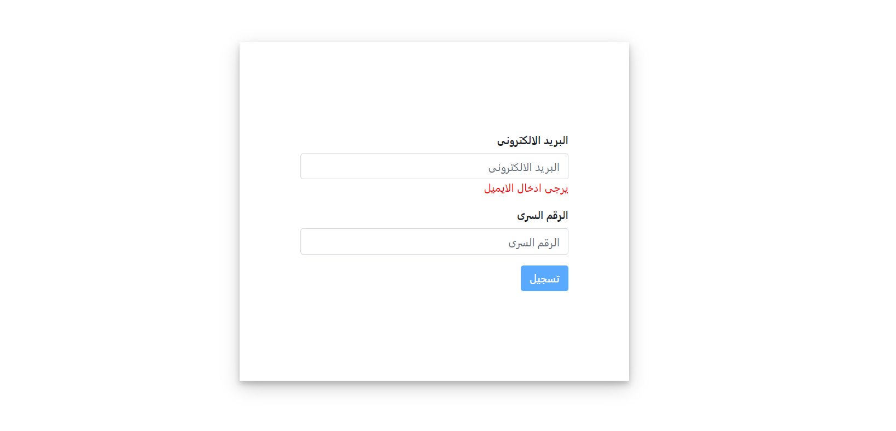
player list
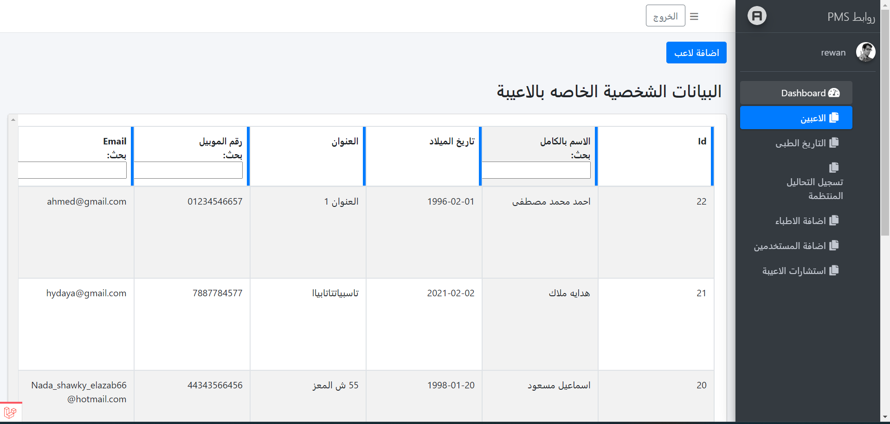
add player
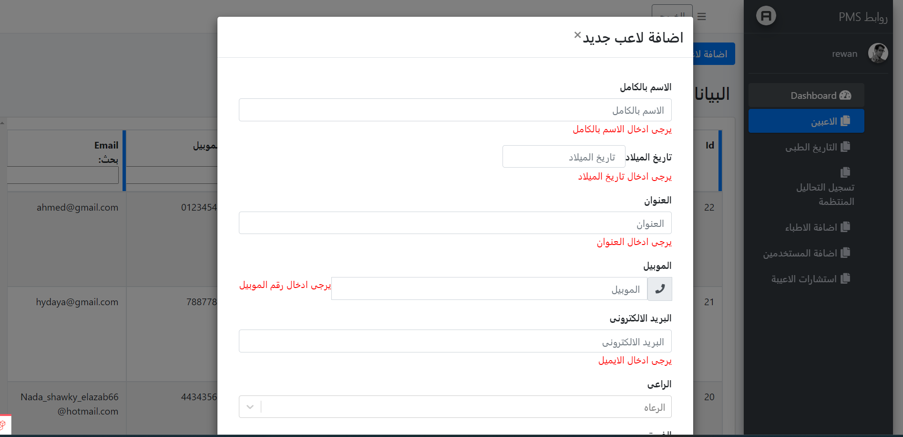
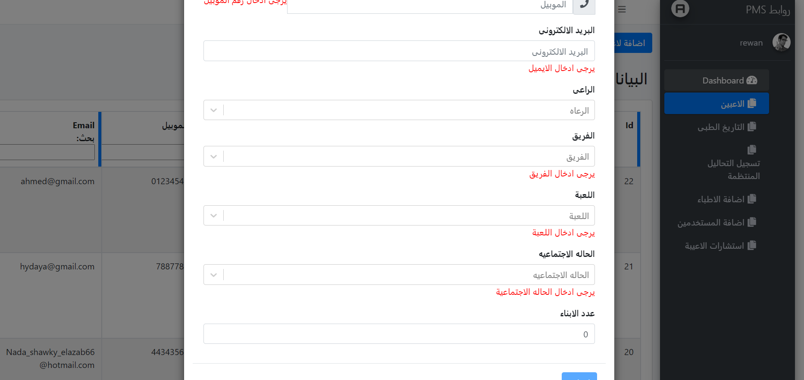
medical history list
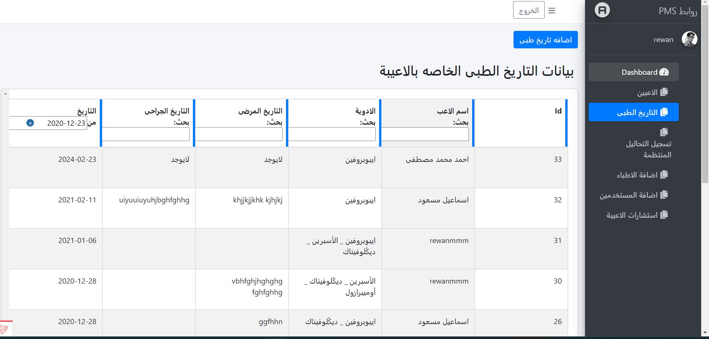
add medical history
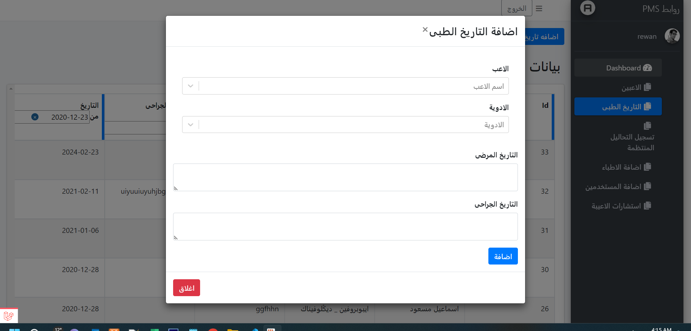
regular analysis list
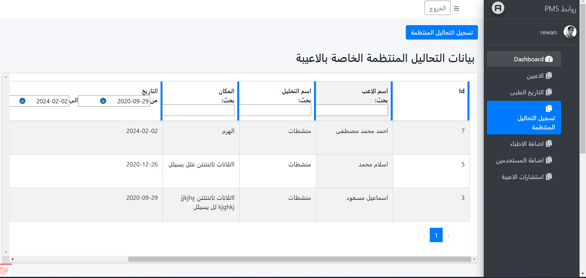
add regular analysis
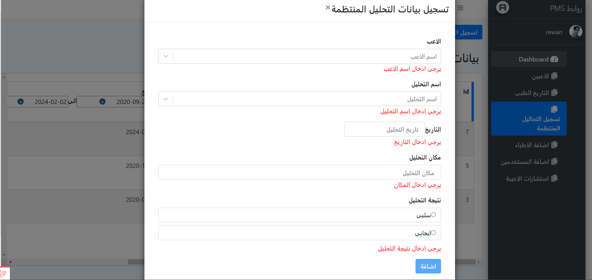
add doctors
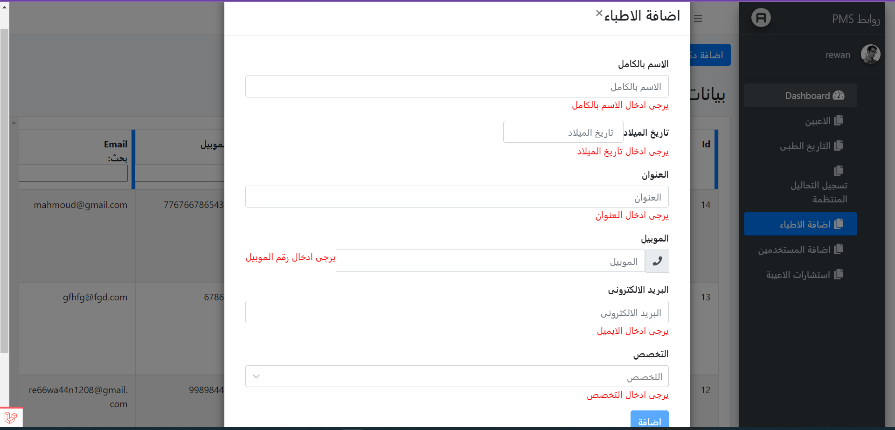
users list
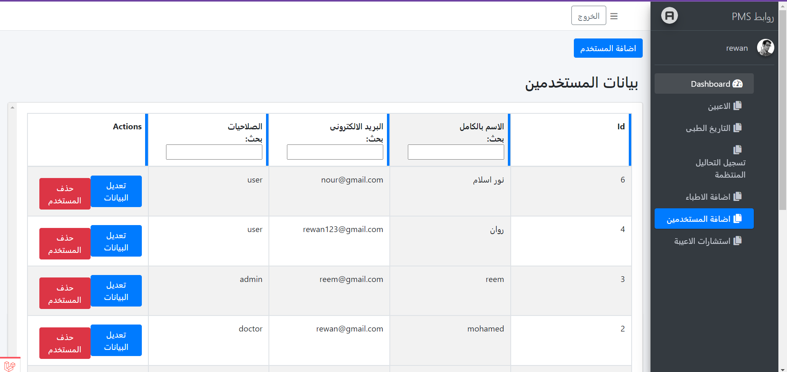
add user
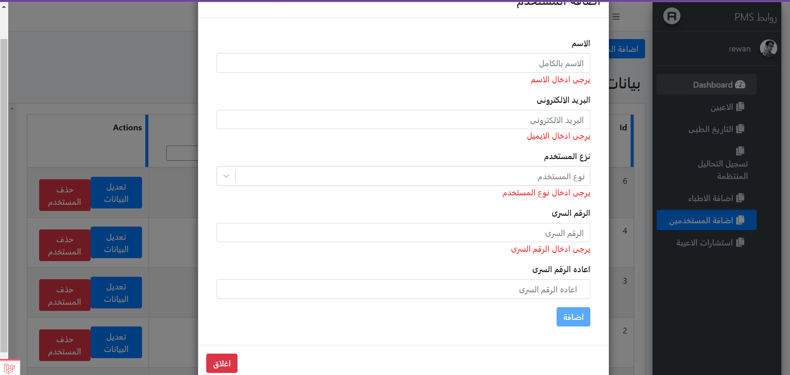
add consultation
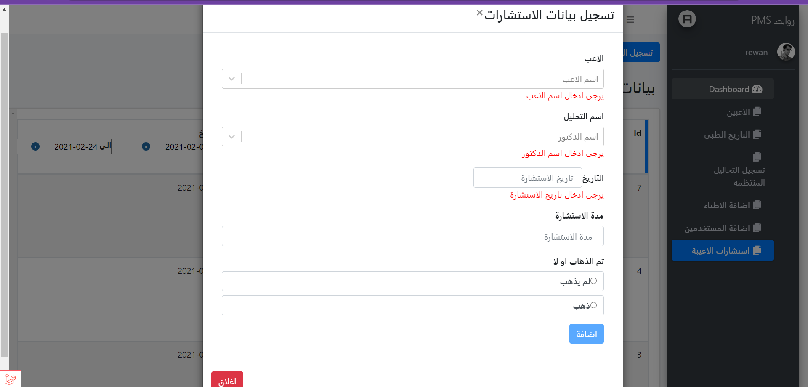

